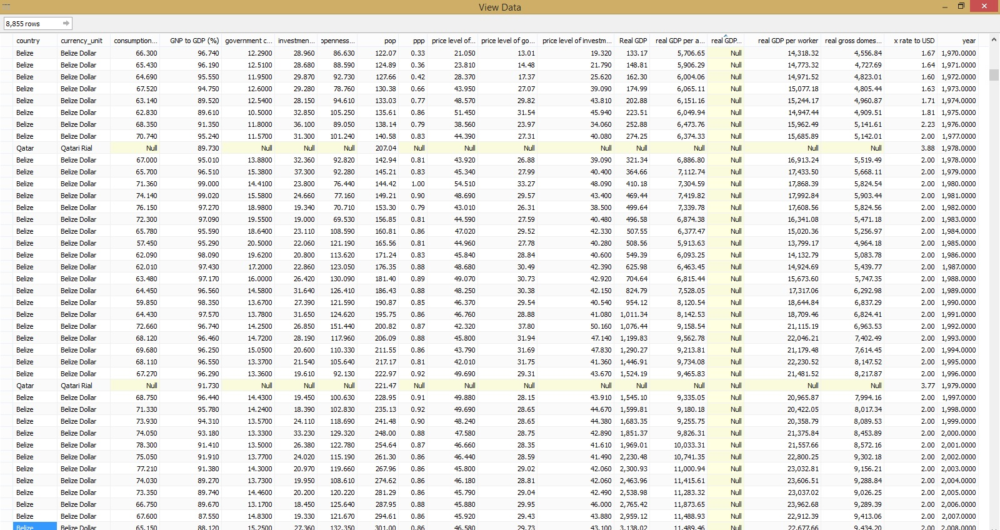
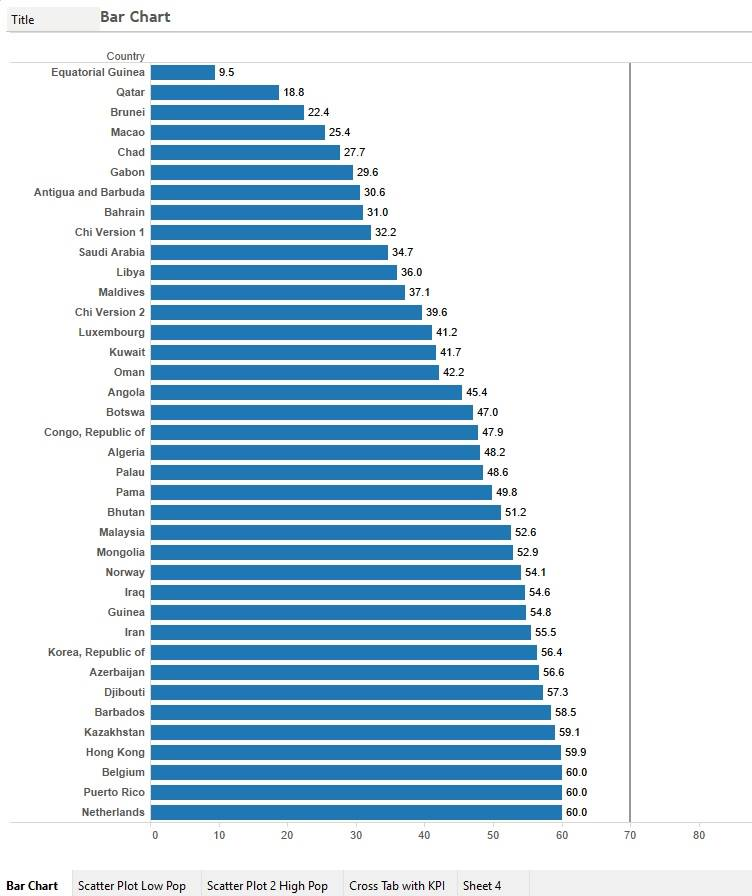
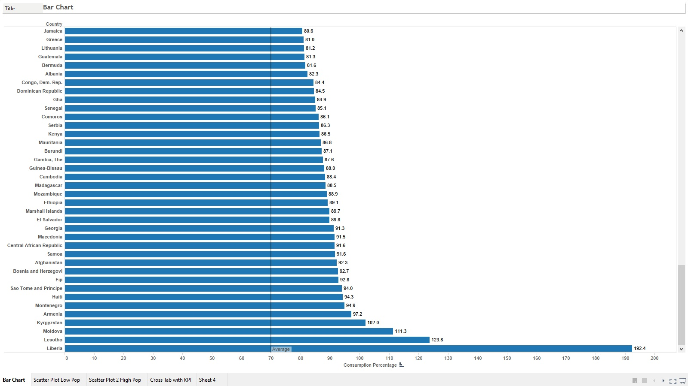
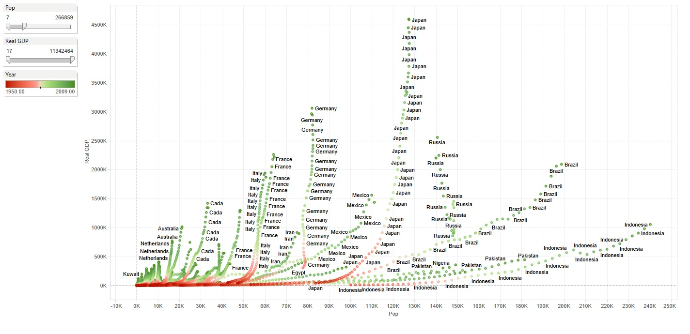
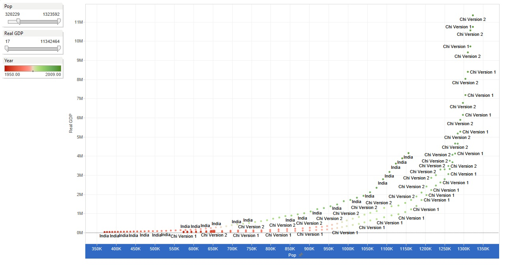
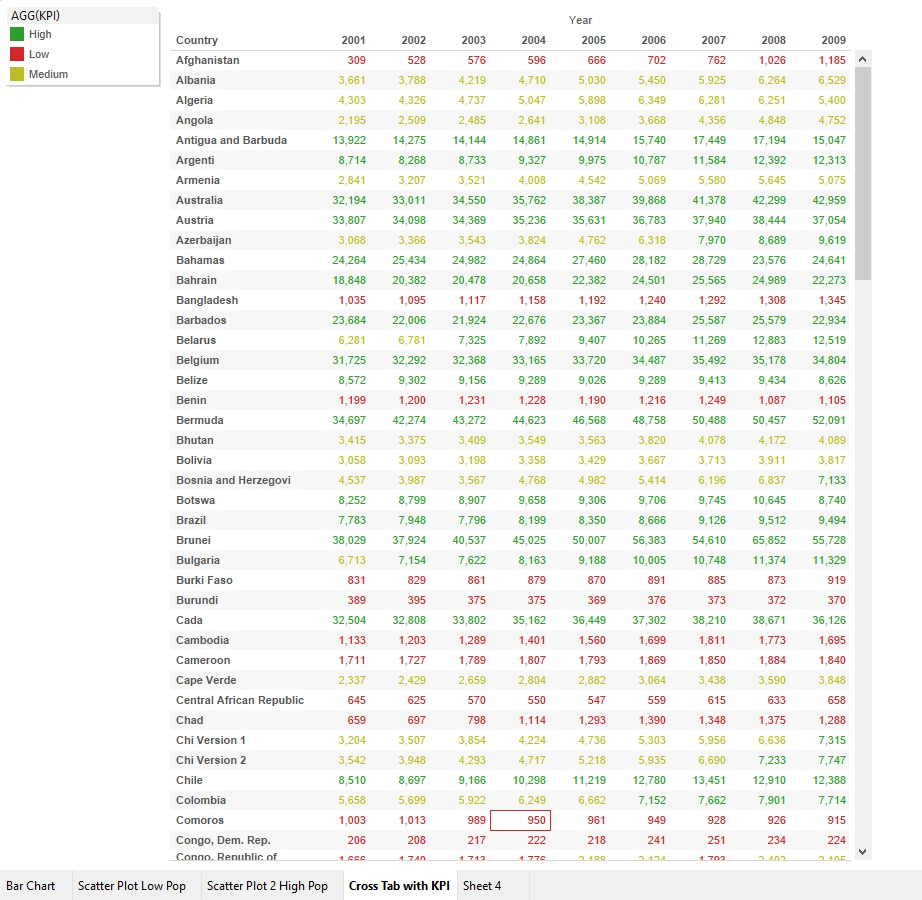
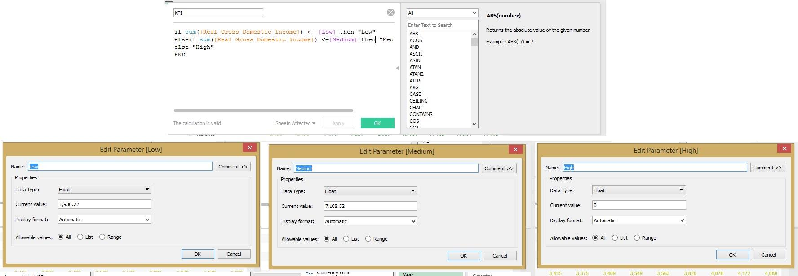
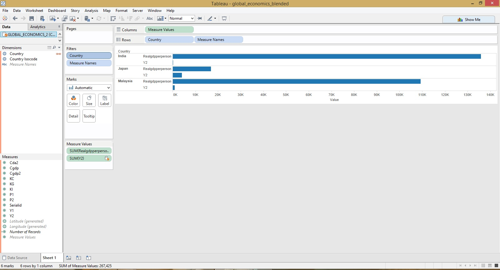
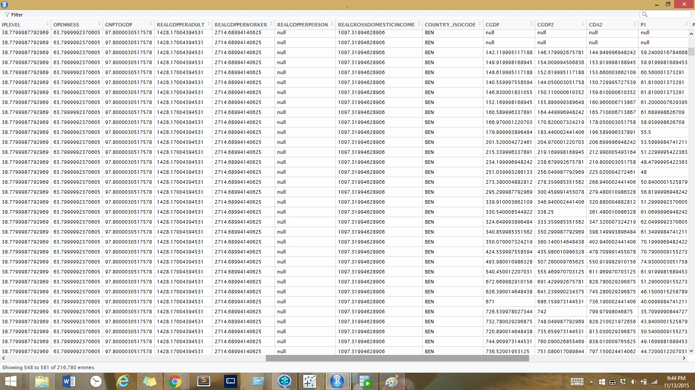

### Data Frame


### ETL.R


```{r tidy = TRUE}
source("../01 Data/barchart.R", echo = TRUE)
```

## Global Economic Data
"The Penn World table contains national income and purchasing power data for 189 countries and territories for available years between 1950 and 2009. The data has been converted into common currency and its updated on an annual basis. Funding for this research is provided by the National Science Foundation (NSF)."  

##Bar Charts

### Using Tableau (Low Consumption Percentage)
  

### Using Tableau (High Consumption Percentage)


* Columns: SUM(Consumption Percentage of Real GDP)  
* Rows: Country  
* Filters: Year: 2009  
* Label: SUM(Consumption Percentage of Real GDP)

**We created two bar charts in Tableau to capture both ends of the consumption percentages (high and low)

### Using R

```{r tidy = TRUE}
source("../01 Data/barchart.R", echo = TRUE)
```

* The average consumption percentage of GDP is 70% for 2009, the year after the stock market crash. 
* Equatorial Guinea had a consumption percentage of 9.5% of their GDP, while Liberia had a percentage of 192.4%.  

## Scatter Plots 
### Using Tableau (Low Population)
  

* Columns: Population  
* Rows: Real GDP  
* Filters: Population: 7-266,859; Color: Year  
* Label: Country  

* The color ranged from red to green, 1950 to 2009 respectively. Using these colors, the visualizations depict the population and Real GDP growth rates over time.  
* Italy, France, and Germany's population growth rates plateaued around the 1980s.  
* Japan's Real GDP rate increased more significatly than any other country in this population range.  
* Pakistan and Indonisia's population rate are continuing to grow, while their economies did not not expand as much as the other countries.  

### Using R
```{r tidy = TRUE}
source("../01 Data/scatterplot.R", echo = TRUE)
```


### Something extra! (High Population)
  

**We found some interesting differences in GDP growth between countries with low populations and countries with high population, and decided to include it here.

* Columns: Population  
* Rows: Real GDP  
* Filters: Population: 320,229-1,323,592; Color: Year  
* Label: Country  

* These countries were isolated from the other plot due to higher populations.  
* India and China's Real GDP and population grew immensely in the 21st century.  
* China's Real GDP has doubled in the past decade.  


## Cross Tabs
### Using Tableau  
  

* Columns: Year  
* Rows: Country  
* Filters: Year: 2001-2009, Color: AGG(KPI)  
* Label: Real Gross Domestic Income  

* Real Gross Domestic Income of countries from 2001-2009.  
* Low Key Performance Indicator (Real Gross Domestic Income) <= $1,930.22  
* Medium Key Performance Indicator (Real Gross Domestic Income) <= $7108.52  
* High Key Performance Indicator (Real Gross Domestic Income) > $7108.52  
* Azerbaijan's real gross domestic income tripled in under a decade.  
* Belarus' real gross domestic income doubled in under a decade.  

### Using R
```{r tidy = TRUE}
source("../01 Data/cross_tab.R", echo = TRUE)
```

### Calculated Fields and Parameters
* Examples of the setting and adjustments used to create the visualizations.  
    


## Blending Data Sources
### Using Tableau


### Using R


*The new columns start with "Country_Isocode"

```{r tidy = TRUE}
source("../01 Data/blended_data.R", echo = TRUE)
```

Citation:
https://app.enigma.io/table/edu.upenn.econ.pwt?row=0&col=30&page=1
